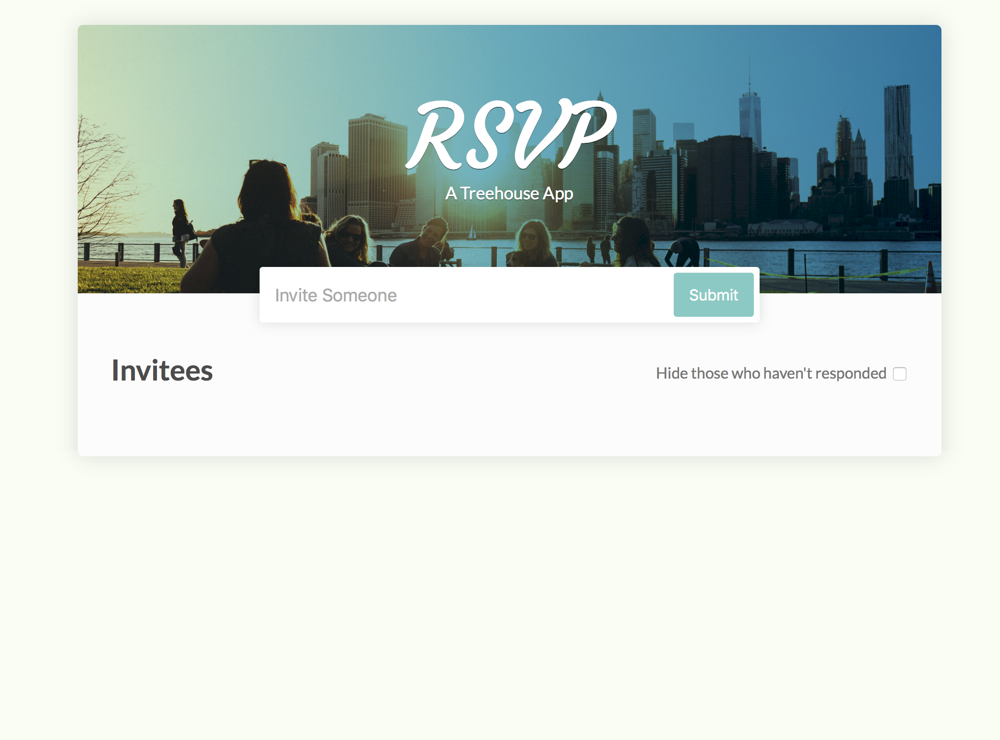
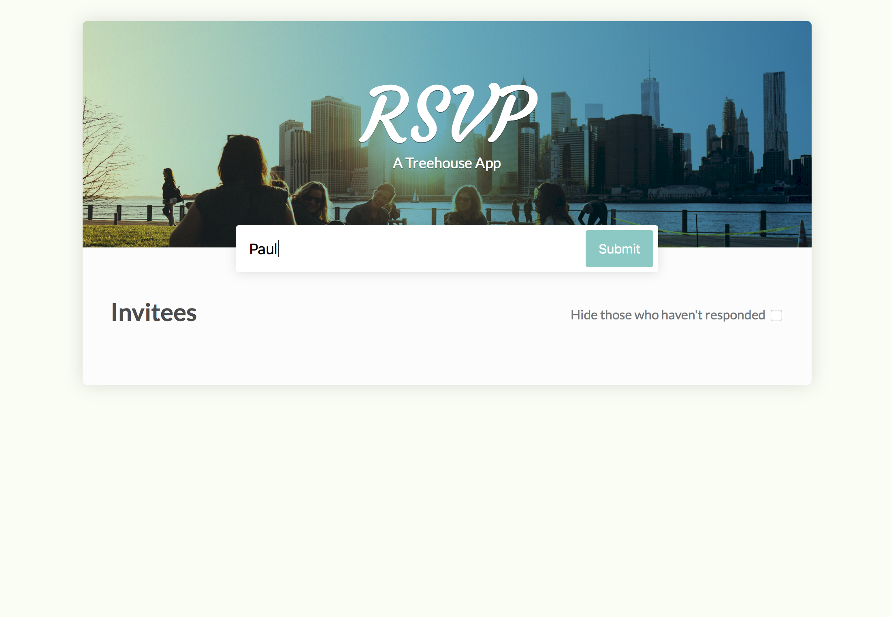
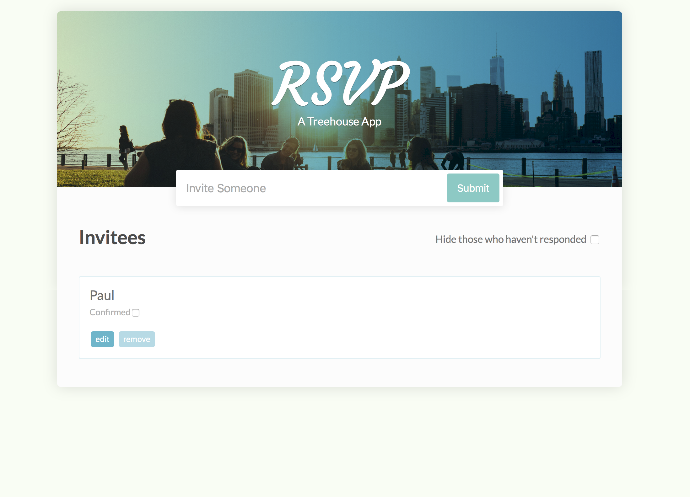
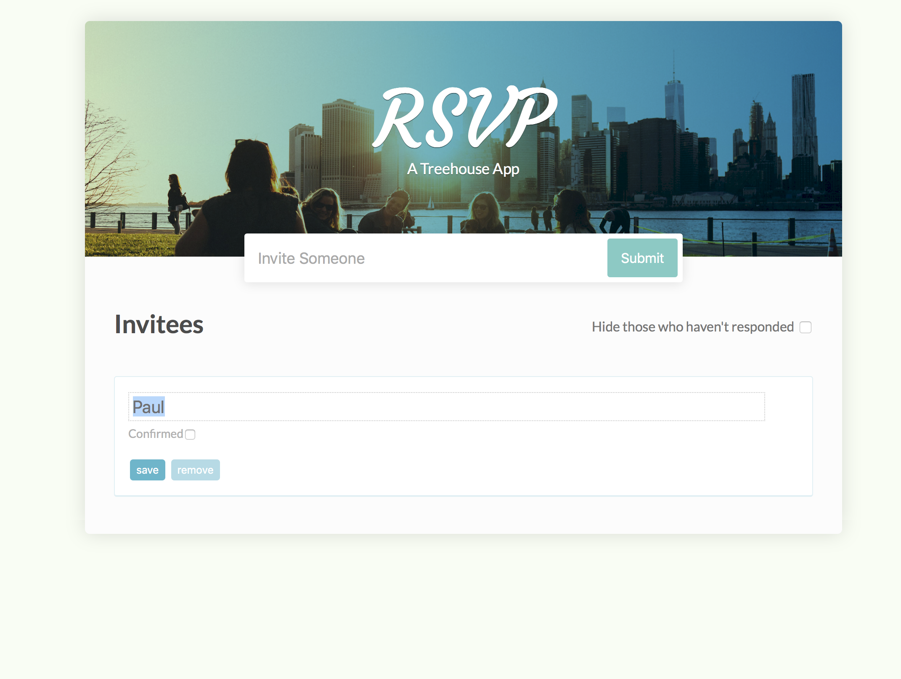
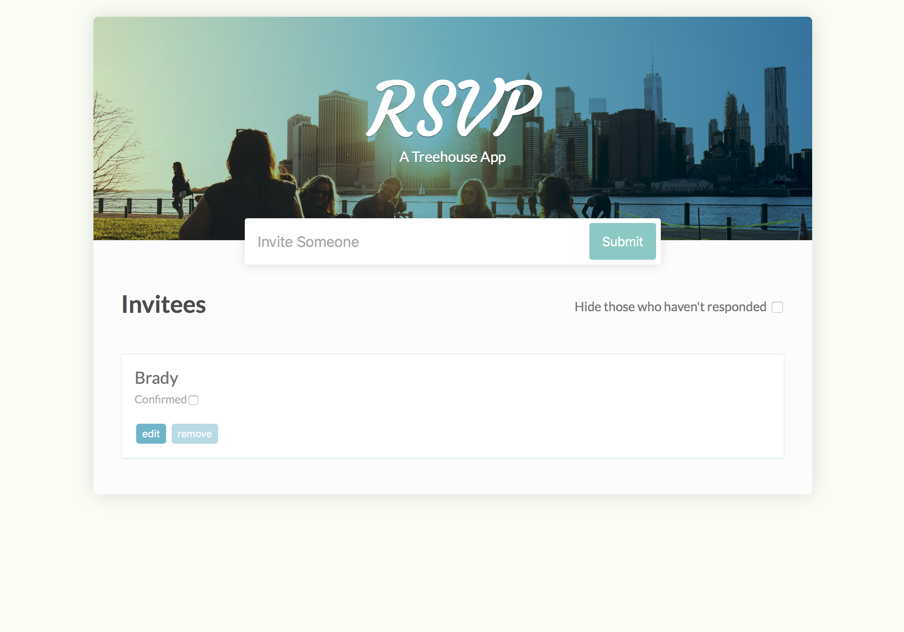
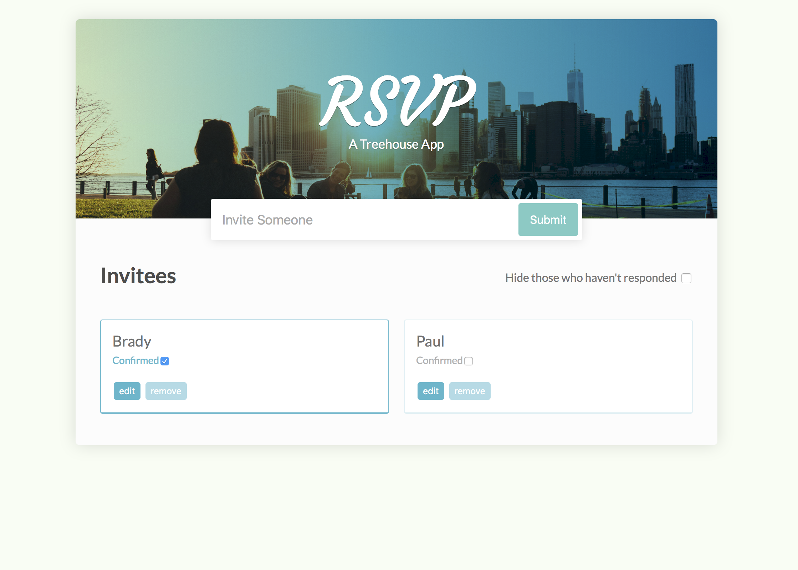
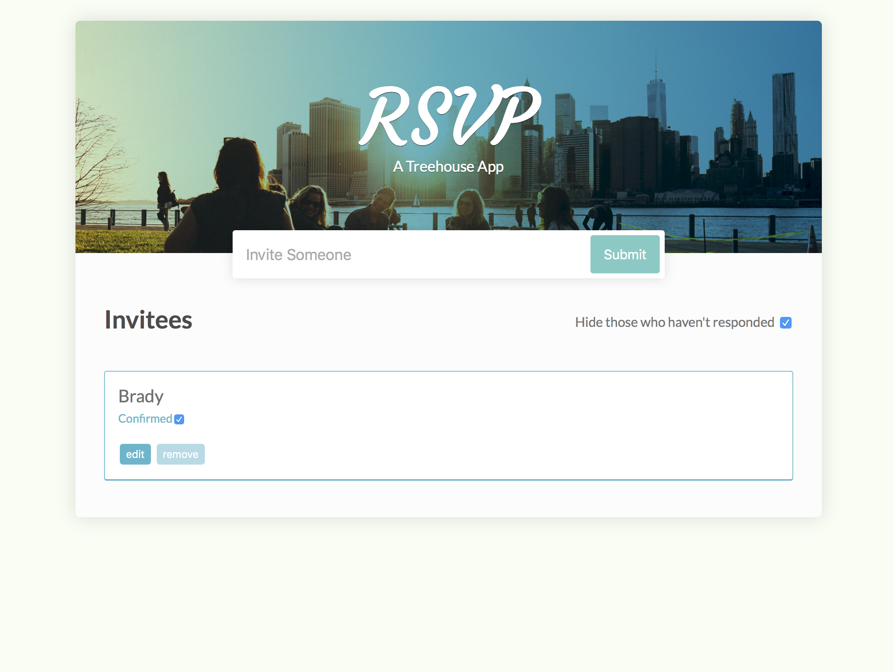

## Summary

This repo is a practice of using JavaScript to build a RSVP app, the scenario of using this app is that you plan to invite people to come for a kind of activity, and you want to ensure who will present.

*All the step is followed by [Beginning JavaScript Course](https://teamtreehouse.com/tracks/beginning-javascript) in Treehouse.*

## Functions

This app includes three function

 - Add New Invitee
 - Edit/Remove the invitee
 - Filter the invitee who will present

## Usage

Download the repo, and open the html file directly.

<figure style="text-align: center;">
    
    <figcaption style="display: block;">Landing Page</figcaption>
</figure>


#### Add New Invitee

<figure style="text-align: center;">
    
    <figcaption style="display: block;">Add new invitee</figcaption>
</figure>

By clicking the **Submit** Button, the new invitee will be added.

<figure style="text-align: center;">
    
    <figcaption style="display: block;">New invitee is been added</figcaption>
</figure>

#### Edit/Remove the invitee

By clicking the **Edit** Button, you can edit the invitee.

<figure style="text-align: center;">
    
    <figcaption style="display: block;">Edit Invitee</figcaption>
</figure>

Save your edit, and the name will immediately change.

<figure style="text-align: center;">
    
    <figcaption style="display: block;">After edit invitee</figcaption>
</figure>

#### Filter the invitee who will present

If you have some invitee already confirmed to come to the activity and check the checkbox for them.
<figure style="text-align: center;">
    
    <figcaption style="display: block;">Edit Invitee</figcaption>
</figure>

You can view all the confirmed invitee by clicking "Hide those who haven't responded" to see all the confirmed invitee.

<figure style="text-align: center;">
    
    <figcaption style="display: block;">After edit invitee</figcaption>
</figure>

## Code

#### Setting
------------------------------------------------------------------------

First we put the app.js script before \</body> tag to include js file.

index.html

```
  ...
  <script type="text/javascript" src="app.js"></script>
</body>
```

#### Initialize
------------------------------------------------------------------------

app.js
```
const form = document.getElementById('registrar');
const input = form.querySelector('input');

const mainDiv = document.querySelector('.main');
const ul = document.getElementById('invitedList');

const div = document.createElement('div');
const filterLabel = document.createElement('label');
const filterCheckBox = document.createElement('input');
```

We first get all the element that we gonna to use.

#### Add New Invitee
------------------------------------------------------------------------

app.js
```
function createLI(text) {
function createElement(elementName, property, value) {
    const element = document.createElement(elementName);
    element[property] = value;
    return element;
}

function appendToLI(elementName, property, value) {
    const element = createElement(elementName, property, value);
    li.appendChild(element);
    return element;
}

const li = document.createElement('li');
appendToLI('span', 'textContent', text);
appendToLI('label', 'textContent', 'Confirmed')
    .appendChild(createElement('input', 'type', 'checkbox'));
appendToLI('button', 'textContent', 'edit');
appendToLI('button', 'textContent', 'remove');
return li;
}

form.addEventListener('submit', (e) => {
e.preventDefault();
const text = input.value;
input.value = '';
const li = createLI(text);
ul.appendChild(li);
});
```

`e.preventDefault();` will prevent the default submit function which will keep refresh results invitee addition failure.

#### Edit/Remove the invitee
------------------------------------------------------------------------

app.js
```
ul.addEventListener('click', (e) => {
if (e.target.tagName === 'BUTTON') {
    const button = e.target;
    const li = button.parentNode;
    const ul = li.parentNode;
    const action = button.textContent;
    const nameActions = {
    remove: () => {
        ul.removeChild(li);
    },
    edit: () => {
        const span = li.firstElementChild;
        const input = document.createElement('input');
        input.type = 'text';
        input.value = span.textContent;
        li.insertBefore(input, span);
        li.removeChild(span);
        button.textContent = 'save';
    },
    save: () => {
        const input = li.firstElementChild;
        const span = document.createElement('span');
        span.textContent = input.value;
        li.insertBefore(span, input);
        li.removeChild(input);
        button.textContent = 'edit';
    }
    };

    // select and run action in button's name
    nameActions[action]();
}
```

`nameActions[action]()` is a precise way to use first-class function to call all the function instance one time.

####  Filter the invitee who will present
------------------------------------------------------------------------

app.js
```
filterCheckBox.addEventListener('change', (e) => {
const isChecked = e.target.checked;
const lis = ul.children;
if(isChecked) {
    for (let i = 0; i < lis.length; i += 1) {
    let li = lis[i];
    if (li.className === 'responded') {
        li.style.display = '';
    } else {
        li.style.display = 'none';
    }
    }
} else {
    for (let i = 0; i < lis.length; i += 1) {
    let li = lis[i];
    li.style.display = '';
    }
}
});
```

This will loop through all the invitee to find out if it gets the attribute `responded`, if yes, the display style will set to empty; if not, will set to `none`.

app.js
```
ul.addEventListener('change', (e) => {
const checkbox = event.target;
const checked = checkbox.checked;
const listItem = checkbox.parentNode.parentNode;

if (checked) {
    listItem.className = 'responded';
} else {
    listItem.className = '';
}
});
```

This code block means that everytime you change the invitee confirmed status, it will add/remove the attribute 'responded'.

## Conclusion

In this project, we use JavaScript to add/edit/remove html element in the html file. For me, I thimk the most valuable part of this project is the css file, I believe I can use it in the future.
